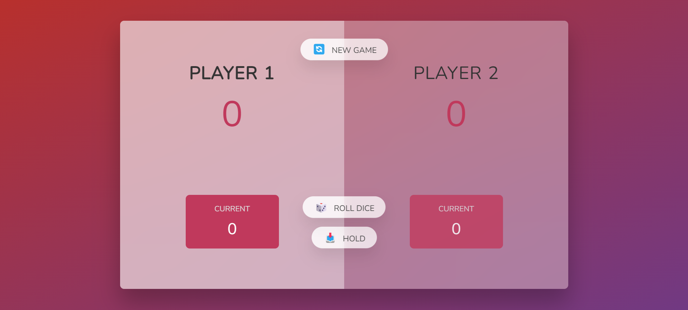

# Pig-Game
This simple pig game is created using JavaScript. The goal of the game is to roll a dice and accumulate points until you reach 100 without rolling a 1. If you roll a 1, your current turn ends, and your points for that turn are forfeited. The first player to reach 100 wins.

# FrontEnd-of-Game

